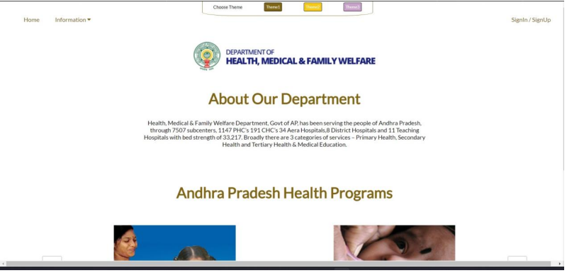

# Andhra Pradesh Healthcare Website Redesign Project

## Table of Contents
- [Introduction](#introduction)
- [Technologies Used](#technologies-used)
- [Key Features](#key-features)
- [Setup Instructions](#setup-instructions)
- [Design Principles](#design-principles)

## Introduction
This project is a redesign of a healthcare website aimed at improving user experience and accessibility. It follows Nielsen's Heuristic Principles for usability, ensuring that the website is intuitive, efficient, and user-friendly. The website provides valuable healthcare information and services to users.

## Technologies Used
- React.js: A JavaScript library for building user interfaces.
- Firebase: A cloud-based platform for developing web and mobile applications, used for database management.

## Key Features
- User-friendly and responsive design.
- Access to healthcare information, articles, and resources.
- Appointment booking system.
- User authentication and secure data storage.
- Integration with Firebase for real-time data updates.

## Setup Instructions
Follow these steps to set up the project locally:

1. Clone or download the repository to your local machine.
2. Navigate to the project directory.
3. Install the project dependencies by running:
    npm install
4. Configure Firebase for your project by creating a Firebase project and obtaining the configuration details.
5. Create a `.env` file in the project root and add your Firebase configuration details:
    REACT_APP_API_KEY=<Your Firebase API Key>
    REACT_APP_AUTH_DOMAIN=<Your Firebase Auth Domain>
    REACT_APP_PROJECT_ID=<Your Firebase Project ID>
    REACT_APP_STORAGE_BUCKET=<Your Firebase Storage Bucket>
    REACT_APP_MESSAGING_SENDER_ID=<Your Firebase Messaging Sender ID>
    REACT_APP_APP_ID=<Your Firebase App ID>
6. Start the development server by running:
     npm start

7. Open your browser and navigate to `http://localhost:3000` to access the website locally.

## Design Principles
The redesign of this healthcare website follows Nielsen's Heuristic Principles for usability, including:
- Visibility of system status
- Match between system and the real world
- User control and freedom
- Consistency and standards
- Error prevention
- Recognition rather than recall
- Flexibility and efficiency of use
- Aesthetic and minimalist design
- Help users recognize, diagnose, and recover from errors
- Help and documentation



